<p align="center">
  <picture>
    <source media="(max-width: 760px) and (prefers-color-scheme: dark)" srcset="./assets/portrait-mobile-dark.svg">
    <source media="(max-width: 760px)" srcset="./assets/portrait-mobile-light.svg">
    <source media="(prefers-color-scheme: dark)" srcset="./assets/portrait-dark.svg">
    <source media="(prefers-color-scheme: light)" srcset="./assets/portrait-light.svg">
    
  </picture>
</p>

<div align="center">

  <h1>👋 Shivam S. Pimple</h1>
  <p><strong>Full-Stack Web Developer (MERN) • Software Engineering Student</strong></p>
  <p><em>Building scalable full-stack web applications with clean architecture and production-ready systems.</em></p>

  <p>
    <a href="https://www.linkedin.com/in/shivam-pimple-894201316" target="_blank">
      
    </a>
    <a href="mailto:shivampimple29@gmail.com">
      
    </a>
    <a href="https://github.com/shivampimple29">
      
    </a>
  </p>

</div>

---

### ⚡ System Overview // About Me

```yaml
Name:        Shivam S. Pimple
Role:        Full-Stack Web Developer (MERN)
Education:   B.Tech in Information Technology (2024–2028)
Focus:       Scalable Backend APIs, Frontend Architecture & Databases
Philosophy:  Clean Architecture • Modular Code • Production-Ready Systems
Objective:   Engineering high-impact, real-world software solutions
```

---

### 🎓 Professional Training

> **Full-Stack Web Development (MERN)** — *Apna College (Sigma 8 Batch)*  
> Comprehensive hands-on engineering track covering:
> - **Frontend Architecture:** Modern React workflows, state management & responsive UI design.
> - **Backend Engineering:** Robust RESTful APIs with Node.js & Express.
> - **Database Modeling:** Scalable MongoDB schemas, indexing & CRUD operations.
> - **End-to-End Delivery:** Production-ready deployments & full-stack integration.

---

### 🛠️ Tech Stack & Capabilities

#### 🎨 Frontend Development
<p align="left">
  
  
  
  
  
  
  
</p>

#### ⚙️ Backend & API Engineering
<p align="left">
  
  
  
  
</p>

#### 🗄️ Databases & Storage
<p align="left">
  
  
  
  
</p>

#### 🧠 Languages, DSA & OOP
<p align="left">
  
  
  
  
</p>

#### 🧰 Tools & Platforms
<p align="left">
  
  
  
  
  
</p>

---

### 📊 Telemetry & GitHub Metrics

<p align="center">
  
  
</p>

<p align="center">
  
</p>

---

<p align="center">
  <code>signal.locked &gt; Continuous learning • Real-world projects • Scalable systems</code>
</p>
